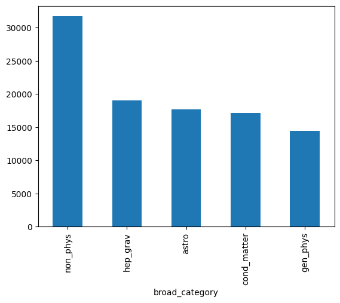
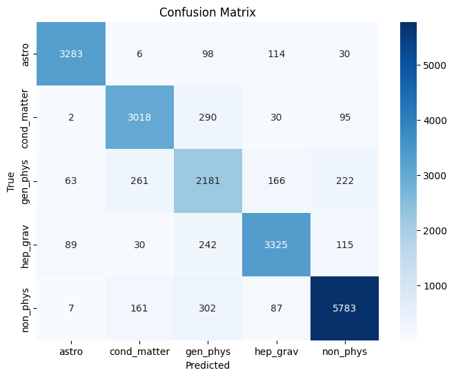

# Arxiv Abstract Classifier
Evan Frangipane

- [Goal](#goal)
- [Dataset](#dataset)
- [Results](#results)
  - [Logistic Regression](#logistic-regression)
  - [BERT](#bert)

## Goal

Create an End to End machine learning pipeline to classify physics paper
abstracts into broad categories and deploy the model for anyone to test.
The baseline model is logistic regression, (SVM gave essentially
identical results to LR), and BERT. Currently the logistic regression
model is being hosted on
[Render](https://arxiv-classifier.onrender.com/). Please give the app a
minute to wake up if it has gone to sleep.

## Dataset

The dataset is 100k paper entries on arxiv from 2007 to 2025. To reduce
class imbalance I created more broad categories. I did my best to
associate similar topics and also used arxiv’s classification when I
could. I present a histogram with classes and their populations.

To briefly describe these categories:

- gen_phys: papers whose primary category is physics.\* as well as
  nuclear and quantum physics
- hep_grav: high energy physics (hep.\*) and gravity and quantum
  cosmology (gr-qc)
- astro: astrophysics
- cond_matter: condensed matter
- non_phys: everything else (math, computer science, etc.)

## Results

### Logistic Regression

| Class       | Precision | Recall | F1-Score | Support |
|-------------|-----------|--------|----------|---------|
| astro       | 0.95      | 0.93   | 0.94     | 3531    |
| cond_matter | 0.87      | 0.88   | 0.87     | 3435    |
| gen_phys    | 0.70      | 0.75   | 0.73     | 2893    |
| hep_grav    | 0.89      | 0.87   | 0.88     | 3801    |
| non_phys    | 0.93      | 0.91   | 0.92     | 6340    |

|              | Precision | Recall | F1-Score | Support |
|--------------|-----------|--------|----------|---------|
| accuracy     |           |        | 0.88     | 20000   |
| macro avg    | 0.87      | 0.87   | 0.87     | 20000   |
| weighted avg | 0.88      | 0.88   | 0.88     | 20000   |

Here is the confusion matrix for Logistic Regression.

### BERT

| Class       | Precision | Recall | F1-Score | Support |
|-------------|-----------|--------|----------|---------|
| astro       | 0.94      | 0.95   | 0.94     | 3531    |
| cond_matter | 0.87      | 0.89   | 0.88     | 3435    |
| gen_phys    | 0.77      | 0.75   | 0.76     | 2893    |
| hep_grav    | 0.89      | 0.90   | 0.90     | 3801    |
| non_phys    | 0.94      | 0.93   | 0.94     | 6340    |

|              | Precision | Recall | F1-Score | Support |
|--------------|-----------|--------|----------|---------|
| accuracy     |           |        | 0.90     | 20000   |
| macro avg    | 0.88      | 0.88   | 0.88     | 20000   |
| weighted avg | 0.89      | 0.90   | 0.89     | 20000   |
